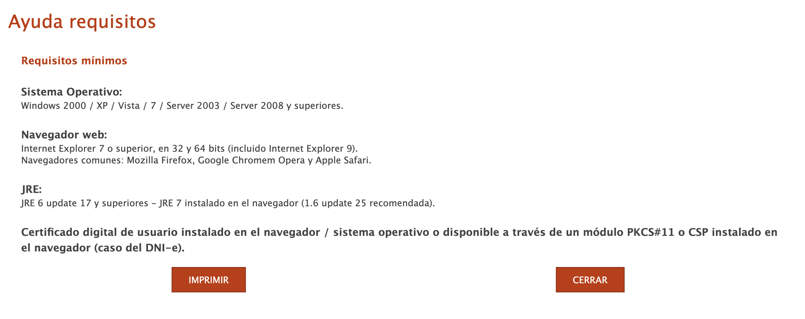

# Spanish Long-Term Visa Application Workaround

## Overview

This repository contains a Docker-based workaround for Spain's breathtakingly progressive government website - a masterful tribute to 2009 featuring exquisitely outdated, deliciously insecure browser technology that modern systems have rather rudely abandoned.

**Website in question**: https://sede.administracionespublicas.gob.es/ (Spanish government digital services portal)

This magnificent digital archaeology represents the pinnacle of **nepomancy**.

**nepomancy** /ˈnepəˌmænsɪ/ *noun* (informal, derogatory)

**1.** The dark art of combining nepotistic appointments with spectacular incompetence to create public services that defy both logic and functionality.

**2.** A system of governance where family connections supersede qualifications, resulting in multigenerational technological dysfunction.

**3.** The mystical practice of transforming taxpayer funds into hereditary contractor profits while delivering Stone Age technology.

*Etymology: nepo- (from nepotism) + -mancy (divination/magic). First observed in Spanish governmental IT procurement, circa 2009.*

**Disclaimer**: This system represents genuine institutional nepomancy - not satire. A digital monument to nepotistic procurement and hereditary incompetence that costs Spanish taxpayers millions annually while delivering Stone Age technology through multigenerational contractor bloodlines.

## The Problem

Spain's government has achieved the impossible: creating a visa system so magnificently broken it requires archaeological software to function. These technological visionaries insist on:


*Official Spanish government website requirements - genuinely demanding 2009-era software*

- **Java Runtime Environment (JRE) 6/7** - Artisanal software with more security holes than Swiss cheese
- **Legacy browsers** supporting NPAPI plugins (deprecated 2015 for being malware delivery systems, but Spain recognises quality)  
- **Heritage operating systems** (Windows 2000/XP/Vista/7) - OS versions predating smartphones, because progress is terribly vulgar
- **Ancient browsers** with vulnerabilities so numerous they'd make medieval siege warfare look secure

Modern browsers sensibly purged Java plugin support years ago. Spain graciously permits authentic governmental computing by forcing you to install digital time bombs just to fill out forms.

## The Solution

**Fear not.** Here you have a digital containment facility for this radioactive Spanish malware. This Docker container serves as your hazmat suit, isolating the toxic 2009-era software whilst keeping your actual computer safely in this century:

- **Ubuntu 20.04** (AMD64 - ARM processors weren't enlightened enough for 2009)
- **OpenJDK 8** with browser necromancy (the final JRE before antivirus software intervened)
- **Firefox ESR 52** (archaeologically preserved from the epoch of blissful vulnerability)
- **AutoFirma 1.9** (Spain's digital signature tool, reliable as a chocolate teapot)
- **VNC access** (direct contact would constitute digital suicide)

## System Requirements

- Docker
- Web browser (for VNC access)
- **Spanish Digital Certificate** (.p12 or .pfx format) - **REQUIRED**

**Note for Apple Silicon (M1/M2/M3) Macs**: This container uses AMD64 architecture (`--platform=linux/amd64`) because Java 7 and legacy browser plugins were never built for ARM64. Docker will automatically use Rosetta translation on Apple Silicon Macs.

## Prerequisites: Digital Certificate Required

⚠️ **IMPORTANT**: This tool requires a Spanish digital certificate to function. You cannot proceed with visa applications without it.

### How to Obtain Your Digital Certificate

If you don't have a Spanish digital certificate yet, you need to obtain one through official Spanish government channels. The most common methods are:

1. **DNI Electrónico (Electronic ID Card)**:
   - Schedule an appointment for DNI renewal/issuance: **https://www.citapreviadnie.es/citaPreviaDni/**
   - The electronic DNI includes digital certificates for authentication and signing
   - Check requirements at www.dnielectronico.es

2. **FNMT-RCM (Fábrica Nacional de Moneda y Timbre)**:
   - Visit their official website for digital certificate services
   - Available for Spanish citizens and residents

**Note**: The process and requirements for obtaining digital certificates can be complex and may vary based on your residency status and location. Please consult official Spanish government websites or contact Spanish consulates for accurate, up-to-date information about digital certificate requirements for your specific situation.

**Without a valid Spanish digital certificate, the government website will not allow you to digitally sign documents or complete visa applications.**

### About cl@ve

**cl@ve is not supported by this tool.** This container is specifically designed to work with digital certificate files (.p12/.pfx format) and the AutoFirma application. The Spanish government website requires traditional digital certificates for the digital signature process needed in visa applications.

### Security Considerations

⚠️ **Important Security Notice**: This container runs deliberately outdated software with known security vulnerabilities that are required by the Spanish government system.

**Security Risks of Required Software:**
- **Firefox ESR 52** (2017) contains numerous unpatched security vulnerabilities
- **Java 8 browser plugins** have well-documented security flaws and are disabled by default in modern browsers
- **Legacy certificate handling** uses deprecated NSS database format (cert8.db)
- **NPAPI plugin support** creates attack vectors that modern browsers have eliminated

**Docker Security Containment:**
- All vulnerable software runs **isolated within the container** - your host system remains protected
- Container filesystem is **ephemeral** - no persistent changes to your actual computer
- Network access is **limited to VNC port** and necessary government sites
- **No direct access** to your host system files or other applications
- When you delete the container, **all traces of the legacy software are removed**

**Best Practices:**
- Only use this container for Spanish government visa applications
- Do not browse other websites or install additional software in the container
- Certificate files are automatically gitignored to prevent accidental commits
- Regularly update the container to get the latest security patches for the base Ubuntu system

The container employs **legacy NSS database format (cert8.db)** for Firefox ESR 52 compatibility. **Docker ensures complete isolation of these deprecated components.**


## Quick Start

1. **Clone this repository:**
   ```bash
   git clone https://github.com/nebojsa-prodana/spanish-long-term-visa-docker.git
   cd spanish-long-term-visa-docker
   ```

2. **Add your Spanish digital certificate:**
   ```bash
   cp /path/to/your-certificate.p12 certs/
   ```
   
   ⚠️ **Note**: Certificate files are gitignored for security.

3. **Start the container:**
   ```bash
   make run
   ```
   This pulls the latest pre-built image from GitHub Container Registry.

4. **Open the browser interface:**
   - Navigate to: `http://localhost:8080/vnc.html`
   - Click "Connect"

5. **Use the Spanish government website:**
   - Firefox will open with the government portal
   - Your certificates will be automatically imported
   - Complete your visa application

6. **Clean up when finished:**
   ```bash
   make clean
   ```
   This removes the container and cleans up Docker resources.

## Advanced Usage

**For Development/Custom Builds:**
If you need to build the image locally instead of using the pre-built one:
```bash
make build-and-run
```

## Usage Commands

**Normal Usage:**
Just navigate to `http://localhost:8080/vnc.html` in your browser and use the Spanish government website through Firefox.

**Getting Started:**
- `make run` - Pull and run the latest pre-built image
- `make build-and-run` - Build locally and run (for development)

**When Finished:**
Run `make clean` to remove the container and free up system resources.

**For Troubleshooting:**
If you need diagnostics or manual intervention, open a terminal in the container:
```bash
make shell
```

Type `visa-help` for comprehensive troubleshooting commands and diagnostic tools.

**Important**: All operations happen inside the container - your host system remains unaffected.

### Certificate Management

**Automatic Import:**
The container automatically discovers and imports certificates from the `certs/` directory during startup.

**Steps:**
1. Place your certificate file in the `certs/` directory before starting the container
2. Run `make run` 
3. Enter your certificate passphrase when prompted
4. Verify import with: `cert-list`

**Manual Import:**
If automatic import fails: `cert-import-manual /certs/your-certificate.p12`

**Firefox Certificate Import:**
Certificates can also be imported through Firefox:
1. Go to `Edit → Preferences → Advanced → Certificates → View Certificates`
2. Click the `Authorities` tab
3. Click `Import` and select your certificate file
4. Check the appropriate trust settings

## After Approval: Booking Your Appointment (Cita)

🎉 **Congratulations!** Once your long-term residence application is approved, you need to book an appointment (cita) at a police office for fingerprinting (toma de huellas).

### Automated Cita Checker with Multi-Channel Notifications

The Spanish police appointment system rarely has available appointments. This repository includes an automated script that runs inside the Docker container to check for availability every 30 minutes and **aggressively notifies you** via multiple channels.

**Quick Start:**
```bash
# 1. Start Docker container (mounts cita-checker folder)
make run

# 2. Open shell in container
make shell

# 3. Start monitoring with notifications (EMAIL REQUIRED)
/workspace/cita-checker/monitor-cita.sh start \
  -p "Barcelona" \
  -o "Barcelona" \
  -t "POLICIA-TOMA DE HUELLAS" \
  --email-to your-email@gmail.com \
  --smtp-server smtp.gmail.com \
  --smtp-user your-email@gmail.com \
  --smtp-pass your-app-password

# 4. Add SMS/Call notifications (highly recommended!)
/workspace/cita-checker/monitor-cita.sh start \
  -p "Barcelona" \
  -o "Barcelona" \
  -t "POLICIA-TOMA DE HUELLAS" \
  --email-to your-email@gmail.com \
  --smtp-server smtp.gmail.com \
  --smtp-user your-email@gmail.com \
  --smtp-pass your-app-password \
  --twilio-sid ACxxxxx \
  --twilio-token your_token \
  --twilio-from +1234567890 \
  --twilio-to +0987654321 \
  --call
```

**Notification Channels:**
- ✅ **Email** (REQUIRED) - HTML message with VNC link
- ✅ **SMS** (optional) - Text message via Twilio  
- ✅ **Phone Call** (optional) - Automated voice call via Twilio
- ✅ **System Beeps** - Audio alerts
- ✅ **Urgent File** - Creates `/tmp/CITA_AVAILABLE_NOW.txt`

**How it works:**
1. Script runs inside Docker every 30 minutes (configurable)
2. Uses Selenium to automate Firefox with your digital certificate
3. When appointment found:
   - **Sends notifications via ALL configured channels**
   - **Stops checking automatically**
   - **Leaves browser open on the booking page**
4. **You check VNC** (http://localhost:8080/vnc.html) to complete booking immediately

**Why so aggressive?** Appointments fill within 5-10 minutes of appearing. Multiple notification channels ensure you don't miss it!

**Twilio (SMS/Call):** FREE trial with $15 credit - enough for hundreds of notifications. Sign up at https://www.twilio.com/try-twilio

**Live Editing:** The `cita-checker/` folder is mounted from your host machine. Edit scripts without rebuilding the container!

**Full Documentation:** See [cita-checker/CITA_README.md](cita-checker/CITA_README.md) for detailed setup, Twilio configuration, and troubleshooting.

## Troubleshooting

If something doesn't work as expected:

1. **First**: Try refreshing the browser or restarting the container with `make run`

2. **For detailed diagnostics**: Open a terminal in the container:
   ```bash
   make shell
   ```
   
3. **Follow the built-in help**: Type `visa-help` in the container terminal for comprehensive troubleshooting commands and diagnostics

The container includes extensive diagnostic tools and step-by-step troubleshooting guidance accessible through the terminal welcome page.


## Contributing

If you discover improvements or fixes, please contribute back to help other victims of this bureaucratic war crime masquerading as a government service.

---

*"Spanish bureaucracy: Where nepotism meets Windows XP, and both are somehow still running the country..."*