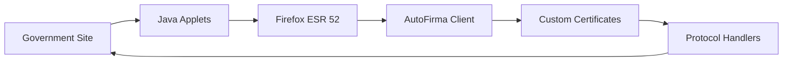
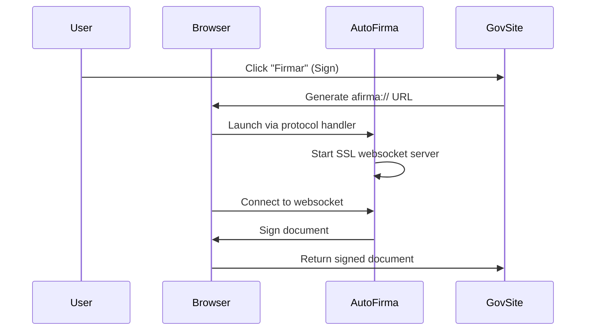
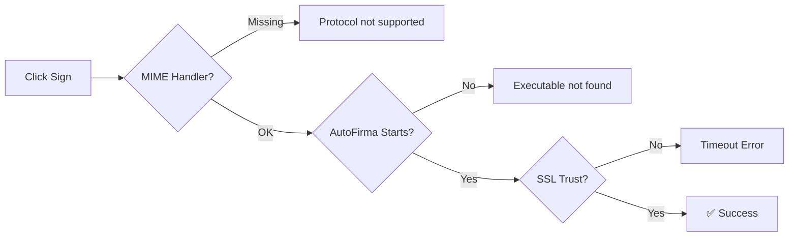

# Spanish Government Digital Signing Setup

## What This Does

Docker container for signing documents on Spanish government websites using AutoFirma (Spain's official digital signing software).

## The Problem

Spanish government sites require an ancient tech stack that's impossible to run on modern systems:



## Why It's Complex

### 1. Legacy Browser Requirements
- **Firefox ESR 52**: Last version supporting Java applets
- **Java 11**: Compatible with both legacy sites and AutoFirma
- **NPAPI plugins**: Deprecated technology still required

### 2. AutoFirma Integration



## What Each Component Does

| Component | Purpose | Breaks Without It |
|-----------|---------|-------------------|
| Firefox ESR 52 | Java applet support | Sites don't load |
| AutoFirma | Official signing client | Legally required |
| SSL Certificates | Secure browser↔client | Timeout errors |
| Protocol Handler | Launch AutoFirma from browser | "Protocol not supported" |
| X11/VNC | GUI in container | No visual interface |

## Critical Setup Steps

### 1. Certificate Generation
```bash
# AutoFirma generates its own CA
java -jar autofirmaConfigurador.jar
```

### 2. System Trust
```bash
# Install CA in system store
cp AutoFirma_ROOT.crt /usr/local/share/ca-certificates/
update-ca-certificates
```

### 3. Firefox Trust
```bash
# Import CA into Firefox
certutil -A -n "AutoFirma ROOT" -t "CT,C,C" -d firefox-profile -i AutoFirma_ROOT.crt
```

### 4. Protocol Mapping
```bash
# Map afirma:// URLs to AutoFirma
echo "x-scheme-handler/afirma=afirma.desktop" > /usr/share/applications/mimeapps.list
```

## Common Failures

